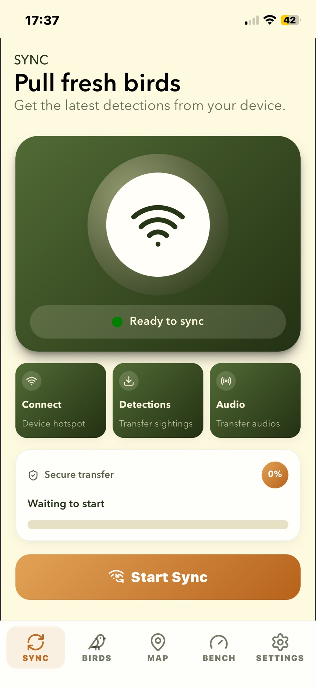
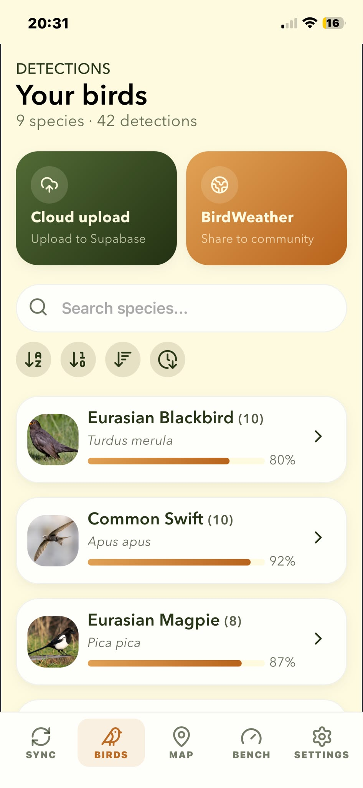
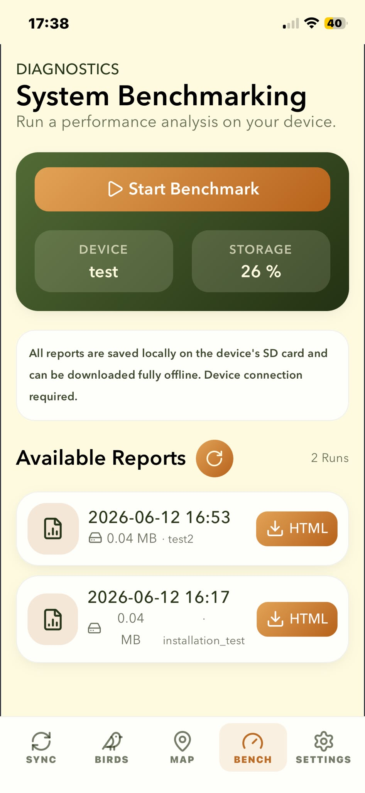
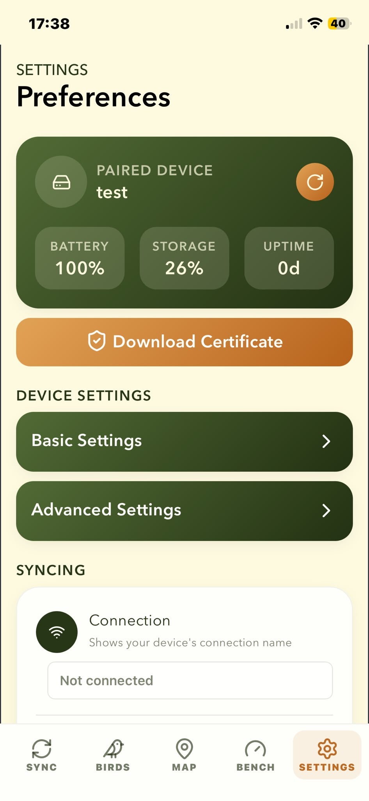

<h1 align="center"><a href="https://github.com/mcguirepr89/BirdNET-Pi/blob/main/LICENSE">Review the license!!</a></h1>
<h1 align="center">You may not use BirdNET-Pi to develop a commercial product!!!!</h1>
<h1 align="center">
  BirdNET-Pi
</h1>
<p align="center">
A realtime and offline acoustic bird classification system for the Raspberry Pi 5, 4B, 400, 3B+
</p>
<p align="center">
  
</p>
<p align="center">
Icon made by <a href="https://www.freepik.com" title="Freepik">Freepik</a> from <a href="https://www.flaticon.com/" title="Flaticon">www.flaticon.com</a>
</p>

## About this fork:

I've been building on [Nachtzuster's](https://github.com/Nachtzuster/BirdNET-Pi) work to further update and improve BirdNET-Pi. Focus here is an fully offline working and interactive system to detect birds in realtime.

**New features:**

- Automated system benchmarking (CPU, RAM, ...) and evaluation
- Display GUI for offline on-device interaction
- Support for two buttons to interact with the display GUI (OK- and NEXT-Button)
- Smarthone App for synching birds data between your Raspberry Pi and your smartphone
- GPS support for a mobile setup

## Introduction

BirdNET-Pi is built on the [BirdNET framework](https://github.com/kahst/BirdNET-Analyzer) by [**@kahst**](https://github.com/kahst) <a href="https://creativecommons.org/licenses/by-nc-sa/4.0/"></a> using [pre-built TFLite binaries](https://github.com/PINTO0309/TensorflowLite-bin) by [**@PINTO0309**](https://github.com/PINTO0309) . It is able to recognize bird sounds from a USB microphone or sound card in realtime and share its data with the rest of the world.

Check out birds from around the world

- [BirdWeather](https://app.birdweather.com)<br>

## Features

- **24/7 recording and automatic identification** of bird songs, chirps, and peeps using BirdNET machine learning
- **Automatic extraction and cataloguing** of bird clips from full-length recordings
- **Tools to visualize your recorded bird data** and analyze trends
- **Live audio stream and spectrogram**
- **Automatic disk space management** that periodically purges old audio files
- [BirdWeather](https://app.birdweather.com) integration -- you can request a BirdWeather ID from BirdNET-Pi's "Tools" > "Settings" page
- Web interface access to all data and logs provided by [Caddy](https://caddyserver.com)
- [GoTTY](https://github.com/yudai/gotty) and [GoTTY x86](https://github.com/sorenisanerd/gotty) Web Terminal
- [Tiny File Manager](https://tinyfilemanager.github.io/)
- FTP server included
- SQLite3 Database
- [Adminer](https://www.adminer.org/) database maintenance
- [phpSysInfo](https://github.com/phpsysinfo/phpsysinfo)
- [Apprise Notifications](https://github.com/caronc/apprise) supporting 90+ notification platforms
- Localization supported

## Requirements

- A Raspberry Pi 5, Raspberry 4B, Raspberry Pi 400, Raspberry Pi 3B+, or Raspberry Pi 0W2 (The 3B+ and 0W2 must run on RaspiOS-ARM64-**Lite**)
- An SD Card with the **_64-bit version of RaspiOS_** installed (please use Trixie) -- Lite is recommended, but the installation works on RaspiOS-ARM64-Full as well. Downloads available within the [Raspberry Pi Imager](https://www.raspberrypi.com/software/).
- A USB Microphone or Sound Card

Further hardware (can be used for offline and mobile interaction, but not required for the core functionality):

- Display: [Waveshare 2.13" 250x122 e-Paper Display HAT for Raspberry Pi](https://www.roboter-bausatz.de/p/waveshare-2.13-250x122-e-paper-display-hat-fuer-raspberry-pi?number=RBS11785&weiche=2&bid=284037-81179-69516c4f-9106-4863-85a6-ebc24a8253c6&adcref=www.google.com%2F)
- 2x Buttons: [Arcade Buttons](https://www.amazon.de/dp/B08L49F7DV?ref=ppx_yo2ov_dt_b_fed_asin_title&th=1) (But also works with any other buttons with two pins)
- GPS Modul: [GY-NEO6MV2 NEO-6M](https://www.amazon.de/dp/B088LR3488?ref=ppx_yo2ov_dt_b_fed_asin_title&th=1)
- Several Jumper cables to connect your hardware to the Raspberry Pi (e.g. [these](https://www.amazon.de/AZDelivery-Jumper-Arduino-Raspberry-Breadboard/dp/B074P726ZR/ref=sr_1_1_sspa?__mk_de_DE=%C3%85M%C3%85%C5%BD%C3%95%C3%91&crid=2QN55Z54UTPDE&dib=eyJ2IjoiMSJ9.QMvsCv-OL1-GLDfzEN_1jyPdDKf2RK1V8SqHyKsM9HfQmnZszW-ubKWXWCB4ktQ3lL1tqkoIbpmj11ttrXW2C2uNo_ulnL3ZpTO6PgZh9NFonRJ8UM1rVnOiVW-leHxv3joaRwpdSoMVscSVkpk6u9OJja-d5rNnR_KEWLTrJSRRN06LY-eVP-S5IWqd0uYEClgiv8in3G3xYd-DCDnKyUz3l8kZldcGzITH8OquRrqiaeZ-wp4fvW3TrRKHUfYG3FH5kyxvDWzCYJrdDbcD5wAektpWjDOztAAhdNfTKcA.U2o14r2fdM3iR1vFhJ2LEr2zDyRvSLM5vc0AnBLDits&dib_tag=se&keywords=jumper%2Bkabel&qid=1781281574&s=industrial&sprefix=jumper%2Bkabel%2Cindustrial%2C167&sr=1-1-spons&aref=VPtEopcrZd&sp_csd=d2lkZ2V0TmFtZT1zcF9hdGY&th=1))
- Power source: An USB C power cable or a power bank for mobile usage

**Power bank requirements:**

- At least 10.000 mAh for better battery life
- 5V and 3A output
- e.g. [Hama Power Pack Performance 20](https://www.mediamarkt.de/de/product/_hama-power-pack-performance-20-powerbank-20000-anthrazit-2921244.html?storeId=401_Handy&utm_source=google&utm_medium=v2-sho&utm_campaign=de|mm|rt|v2-sho|pfm|nsp|PLA-bluePortal-2|na|d2c|NA|OSB0003N0U&utm_term=&utm_content=OSB0003N0U-TCID9732339591-TAID99088501669&gclsrc=aw.ds&gad_source=1&gad_campaignid=9732339591&gbraid=0AAAAADh5Kagw8jbVaTmHbqTMmzzwUcL6I&gclid=Cj0KCQjwrs7RBhDuARIsAIVfBD1g7RtbGs-mwMiouuTaR4_L-atTfENXy_71YWHfIP7EpG1oOMzh64QaAoR1EALw_wcB) (20.000 mAh)

## Installation

[A comprehensive installation guide is available here](https://github.com/mcguirepr89/BirdNET-Pi/wiki/Installation-Guide).

**This guide is slightly out-dated for this fork. Use the command below to install the system.**

Please note that installing BirdNET-Pi on top of other servers is not supported.

The system can be installed with:

```
curl -s https://raw.githubusercontent.com/AntonRauchenberger/BirdNET-Pi/main/newinstaller.sh | bash
```

The installer takes care of any and all necessary updates, so you can run that as the very first command upon the first boot, if you'd like.

The installation creates a log in `$HOME/installation-$(date "+%F").txt`.

If you are having issues with "sudo" during installation, use these commands:

1. `sudo visudo`
2. Add the following line to the end of the file, replace "admin" with your username if different: `admin ALL=(ALL) NOPASSWD: ALL`
3. Test with `sudo ls`, this should work without asking for a password now

## Hardware Setup

Connect your USB microphone and your power source (cable or battery) to the Raspberry Pi and your Pi is ready to go!
For the further hardware features, use these pinouts ([Help: Raspberry Pi Pins](https://pinout.xyz/)):

| Hardware device   | Pin   | Raspberry Pi Pin (physical) | RPi GPIO name  | Function                 |
| ----------------- | ----- | --------------------------- | -------------- | ------------------------ |
| Next-Button       | Pin 1 | Pin 36                      | GPIO 16        | Controls the Display-GUI |
|                   | Pin 2 | Pin 14                      | Ground         |                          |
|                   |       |                             |                |                          |
| OK-Button         | Pin 1 | Pin 37                      | GPIO 26        | Controls the Display-GUI |
|                   | Pin 2 | Pin 9                       | Ground         |                          |
|                   |       |                             |                |                          |
| GPS Modul         | VCC   | Pin 2                       | 5V Power       | Updates GPS data         |
|                   | RX    | Pin 8                       | GPIO 14 (TXD)  |                          |
|                   | TX    | Pin 10                      | GPIO 15 (RXD)  |                          |
|                   | GND   | Pin 34                      | Ground         |                          |
|                   |       |                             |                |                          |
| Waveshare Display | VCC   | Pin 1                       | 3V3 Power      | Display-GUI              |
|                   | GND   | Pin 6                       | Ground         |                          |
|                   | DIN   | Pin 19                      | GPIO 10 (MOSI) |                          |
|                   | CLK   | Pin 23                      | GPIO 11 (SCLK) |                          |
|                   | CS    | Pin 24                      | GPIO 8 (CE0)   |                          |
|                   | DC    | Pin 22                      | GPIO 25        |                          |
|                   | RST   | Pin 11                      | GPIO 17        |                          |
|                   | BUSY  | Pin 18                      | GPIO 24        |                          |

### Power usage estimation

- **Approx. power consumption:** 3.2 Wh/h
- **Estimated battery life with a 20.000 mAh power bank:** ~19 hours (this is a rough estimate and can vary based on the actual power consumption, which depends on the usage and the connected hardware)

## App

### Installation

1. Open this URL with your smartphone browser: `https://antonrauchenberger.github.io/BirdNET-Pi/` (or: `https://tinyurl.com/amuecpf2`)
2. Click on "publish" and then "add to home screen"
3. Open the app from your home screen and open each tab

Now the app is downloaded on your device and you can start with the synchronisation.

### Synchronization

1. On your Raspberry Pi Display: Navigate to the "Sync" page and click the OK-Button to start the hotspot (this can take couple of seconds). Now you can see the hotspot details on your screen.
2. On your smartphone: Go to the WiFi settings and connect to the hotspot.

For the first synchronisation, go to the Settins-Tab on the App and download the certificate from the Pi. Then activate the certificate in your smartphone settings. This is required for the secure synchronisation between the Pi and the app.

- [iPhone documentation](https://support.apple.com/102390)
- [Android documentation](https://support.n4l.co.nz/s/article/Installing-an-SSL-Certificate-on-an-Android-Device-Manually)

3. You should see now information about your connected Pi in the App in the Settings-Tab.
4. Navigate to the "Sync" tab on the App and click "Start Sync". After the successful synchronisation, you should see the birds from your Pi in the "Birds" tab of the App.

### Tabs

**Sync**

Here you can start the synchronisation between your Pi and the App if connected to the Pi's hotspot.



**Birds List**

Shows you all your detected birds in a list. You can click on each bird to see more details about it, including the location, the confidence score and the audio clip of the last detection.
You can save your BirdWeather and Supabase credentials in the App settings to share your birds with the world and to have a backup of your data (more details below).



**Map**

Shows the last updated loaction of your Pi, your current position and the location of your detected birds on a map.
You can save a MapTiler API key in the App Settings to have a better map experience. You can get a free API key from [MapTiler](https://docs.maptiler.com/cloud/api/authentication-key/).

**Benchmarking**

Here you can see the results of past benchmarking tests und you can start a new benchmarking process. (More details below)



**Settings**

Here you can save your different credentials and if connected, you can change your device settings directly from the App.



## Display

The display enables offline interaction with your Pi and is divided into different pages. Each page has an OK-Action and with the NEXT-Button you can move to the next page.

**Pages**:

- **Overview**: Shows the most recent detections and the current system status
    - OK-Action: Refresh the page
- **Live analysis**: Shows the current detected birds in realtime
    - OK-Action: Enable/Disable the result printing (the system keeps looking for birds, even live analysis for the display is disabled)
- **Birds list**: Shows all detected birds in a list
    - OK-Action: Scroll through the list
- **Sync**: Enables the synchronisation between the Pi and the smartphone app (see below)
    - OK-Action: Start/Stop the Pi's hotspot for the synchronisation
- **GPS**: Shows the current location and controls the GPS module
    - OK-Action: Enable/Disable the GPS module

## GPS

If enabled, the GPS module will update the location of the Pi and add it to the detections. This is especially useful for a mobile setup, but can also be used for a stationary setup to track the location of your birds.

Recommendation:

- Enable if you are using the Pi as a mobile station (for backpacking, ...)
- Disable for a stationary setup to save power

## BirdWeather

BirdWeather is a platform for sharing your bird detections with scientists and bird conservationists around the world.

1. Create an account and a station on [BirdWeather](https://app.birdweather.com/account/stations) (set the location to your current position, however this will not be used later on, since the location from your detections will be used)
2. Go to "My stations", click "Edit" on your station and copy the **BirdWeather Token** from the bottom of the page
3. Save the token in your App settings

Now your can upload your detections to BirdWeather in the birds tab on the App.

## Benchmarking (advanced)

The benchmarking process evaluates the performance of your system and helps you to optimize it. It runs a series of tests and provides you with detailed results about the CPU, RAM, and other system metrics.
Each benchmarking process logs different CSV-Files and generates a HTML report in the "benchmarking_results" folder. This reports summarizes the results and provides you with insights about the performance of your system. You can use these insights to optimize your system and to make sure that it runs smoothly.

You can start the benchmarking from your App or use the CLI by connecting to your Pi via SSH and running the following command:

```
./scripts/benchmarking.sh <scenario_name> <iterations> <evaluate: true/false>
```

- `scenario_name`: A name for the benchmarking scenario, e.g. "default", "high_performance", ...
- `iterations`: The number of iterations to run the benchmarking process, e.g. 10
- `evaluate`: Whether to evaluate the results and generate the HTML report, e.g. true

## Cloud Connection (advanced)

You can connect your App to a **Supabase** project to have a backup and to work with your data in the cloud with extended tools.

1. Create a Supabase project on [Supabase](https://supabase.com/)
2. Go to "SQL-Editor" and run the following SQL code to setup your database:

```sql
-- ==========================================
-- Cleanup
-- ==========================================
DROP TABLE IF EXISTS public.detections CASCADE;
DROP TABLE IF EXISTS public.settings CASCADE;
DROP TABLE IF EXISTS public.bird_songs CASCADE;


-- ==========================================
-- Detections
-- ==========================================
CREATE TABLE public.detections (
    id BIGINT PRIMARY KEY,
    date DATE NOT NULL,
    time TIME NOT NULL,
    "scientificName" TEXT NOT NULL,
    "commonName" TEXT,
    confidence NUMERIC,
    latitude NUMERIC,
    longitude NUMERIC,
    cutoff NUMERIC,
    week INTEGER,
    sens NUMERIC,
    overlap NUMERIC,
    "fileName" TEXT,
    "syncedToBirdWeather" BOOLEAN DEFAULT FALSE,
    uncommon BOOLEAN DEFAULT FALSE,
    "createdAt" TIMESTAMPTZ DEFAULT NOW()
);

CREATE INDEX idx_detections_date_time ON public.detections (date, time);

ALTER TABLE public.detections ENABLE ROW LEVEL SECURITY;

CREATE POLICY "Vollzugriff Detections" ON public.detections FOR ALL TO anon USING (true) WITH CHECK (true);


-- ==========================================
-- Settings
-- ==========================================
CREATE TABLE public.settings (
    id TEXT PRIMARY KEY,
    name TEXT,
    description TEXT,
    value TEXT,
    tab TEXT,
    type TEXT,
    icon TEXT,
    disabled BOOLEAN DEFAULT FALSE,
    "defaultValue" TEXT
);

ALTER TABLE public.settings ENABLE ROW LEVEL SECURITY;

CREATE POLICY "Vollzugriff Settings" ON public.settings FOR ALL TO anon USING (true) WITH CHECK (true);


-- ==========================================
-- Bird songs metadata
-- ==========================================
CREATE TABLE public.bird_songs (
    id SERIAL PRIMARY KEY,
    species TEXT NOT NULL,
    timestamp TIMESTAMPTZ NOT NULL,
    audio_url TEXT,
    created_at TIMESTAMPTZ DEFAULT NOW()
);

ALTER TABLE public.bird_songs ENABLE ROW LEVEL SECURITY;

CREATE POLICY "Vollzugriff Bird Songs" ON public.bird_songs FOR ALL TO anon USING (true) WITH CHECK (true);
```

3. Go to "Storage", create a new bucket called `bird-audio` and set the permissions to `public`.
4. Go to "Policies" and create a new policy for the `bird-audio` bucket. Select all operations (SELECT, UPDATE, DELETE, INSERT) and set public to `true`.
5. Go the project's start page and copy the API URL and the anon key. Save these credentials to your App settings.

Now you can upload/download your data on the birds tab.

## Access

The BirdNET-Pi can be accessed from any web browser on the same network:

- http://birdnetpi.local OR your Pi's IP address
- Default Basic Authentication Username: birdnet
- Password is empty by default. Set this in "Tools" > "Settings" > "Advanced Settings"

Please take a look at the [wiki](https://github.com/mcguirepr89/BirdNET-Pi/wiki) and [discussions](https://github.com/mcguirepr89/BirdNET-Pi/discussions) for information on

- [BirdNET-Pi's Deep Convolutional Neural Network(s)](https://github.com/mcguirepr89/BirdNET-Pi/wiki/BirdNET-Pi:-some-theory-on-classification-&-some-practical-hints)
- [making your installation public](https://github.com/mcguirepr89/BirdNET-Pi/wiki/Sharing-Your-BirdNET-Pi)
- [backing up and restoring your database](https://github.com/mcguirepr89/BirdNET-Pi/wiki/Backup-and-Restore-the-Database)
- [adjusting your sound card settings](https://github.com/mcguirepr89/BirdNET-Pi/wiki/Adjusting-your-sound-card)
- [suggested USB microphones](https://github.com/mcguirepr89/BirdNET-Pi/discussions/39)
- [building your own microphone](<https://github.com/DD4WH/SASS/wiki/Stereo--(Mono)-recording-low-noise-low-cost-system>)
- [privacy concerns and options](https://github.com/mcguirepr89/BirdNET-Pi/discussions/166)
- [beta testing](https://github.com/mcguirepr89/BirdNET-Pi/discussions/11)
- [and more!](https://github.com/mcguirepr89/BirdNET-Pi/discussions)

## Updating

Use the web interface and go to "Tools" > "System Controls" > "Update". If you encounter any issues with that, or suspect that the update did not work for some reason, please save its output and post it in an issue where we can help.

## Backup and Restore

Use the web interface and go to "Tools" > "System Controls" > "Backup" or "Restore". Backup/Restore is primary meant for migrating your data for one system to another. Since the time required to create or restore a backup depends on the size of the data set and the speed of the storage, this could take quite a while.

Alternatively, the backup script can be used directly. These examples assume the backup medium is mounted on `/mnt`

To backup:

```commandline
./scripts/backup_data.sh -a backup -f /mnt/birds/backup-2024-07-09.tar
```

To restore:

```commandline
./scripts/backup_data.sh -a restore -f /mnt/birds/backup-2024-07-09.tar
```

## x86_64 support

x86_64 support is mainly there for developers or otherwise more Linux savvy people.
That being said, some pointers:

- Use Debian 12 or 13
- The user needs passwordless sudo

For Proxmox, a user has reported adding this in their `cpu-models.conf`, in order for the custom TFLite build to work.

```
cpu-model: BirdNet
    flags +sse4.1
    reported-model host
```

## Uninstallation

```
/usr/local/bin/uninstall.sh && cd ~ && rm -drf BirdNET-Pi
```

## Troubleshooting and Ideas

*Hint: A lot of weird problems can be solved by simply restarting the core services. Do this from the web interface "Tools" > "Services" > "Restart Core Services"
Having trouble or have an idea? *Submit an issue for trouble* and a *discussion for ideas*. Please do *not* submit an issue as a discussion -- the issue tracker solicits information that is needed for anyone to help -- discussions are *not for issues\*.

PLEASE search the repo for your issue before creating a new one. This repo has nothing to do with the validity of the detection results, so please do not start any issues around "False positives."

## Sharing

Please join [BirdWeather!!](https://app.birdweather.com) and share your detections. It helps scientists and bird conservationists around the world, and it's fun to see your and other birds on a bigger map!

## Cool Links

- [Marie Lelouche's <i>Out of Spaces</i>](https://www.lestanneries.fr/exposition/marie-lelouche-out-of-spaces/) using BirdNET-Pi in post-sculpture VR! [Press Kit](https://github.com/mcguirepr89/BirdNET-Pi-assets/blob/main/dp_out_of_spaces_marie_lelouche_digital_05_01_22.pdf)
- [Research on noded BirdNET-Pi networks for farming](https://github.com/mcguirepr89/BirdNET-Pi-assets/blob/main/G23_Report_ModelBasedSysEngineering_FarmMarkBirdDetector_V1__Copy_.pdf)
- [PixCams Build Guide](https://pixcams.com/building-a-birdnet-pi-real-time-acoustic-bird-id-station/)
- [Core-Electronics](https://core-electronics.com.au/projects/bird-calls-raspberry-pi) Build Article
- [RaspberryPi.com Blog Post](https://www.raspberrypi.com/news/classify-birds-acoustically-with-birdnet-pi/)
- [MagPi Issue 119 Showcase Article](https://magpi.raspberrypi.com/issues/119/pdf)

### Internationalization:

The bird names are in English by default, but other localized versions are available thanks to the wonderful efforts of [@patlevin](https://github.com/patlevin) and Wikipedia. Use the web interface's "Tools" > "Settings" and select your "Database Language" to have the detections in your language.

[Internationalization](docs/translations.md)

## Screenshots


